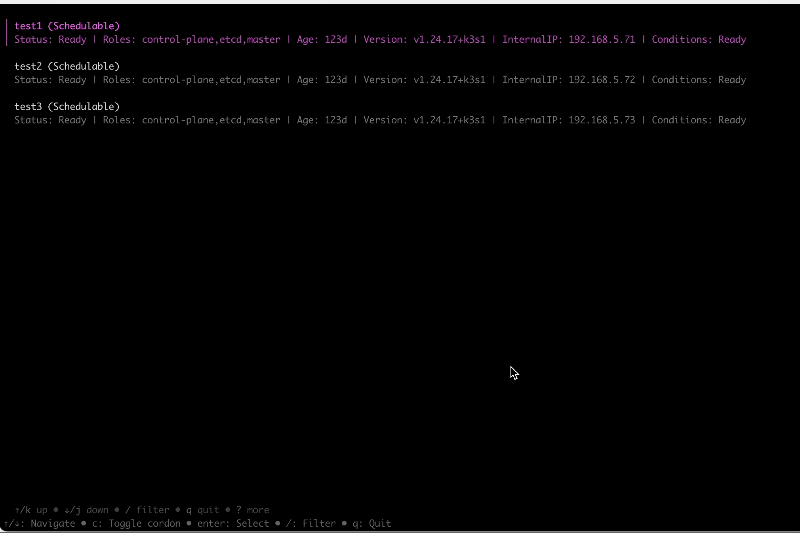

# kubectl-node-maintain

A kubectl plugin that provides an interactive TUI for Kubernetes node maintenance operations.

## Features

### Node Operations
- View node details:
  - Node status (Ready/NotReady)
  - Scheduling status (Schedulable/Cordoned)
  - Node roles
  - Kubernetes version
  - Node conditions
  - Internal IP
  - Age
- Quick cordon/uncordon with 'c' key
- Fuzzy search for nodes

### Maintenance Actions
1. Force Drain Node
   - Safely evict all pods
   - Skip DaemonSet pods
   - Automatic node cordoning

2. Force Delete Non-DaemonSet Pods
   - Automatically skip DaemonSet pods
   - Force delete with zero grace period
   - Automatic node cordoning

3. Selective Pod Deletion
   - Interactive pod selection
   - Multi-select support with space key
   - Show pod details:
     - Namespace
     - Phase
     - Owner reference
     - Age
   - Force delete selected pods
   - Automatic node cordoning

### Safety Features
- Confirmation dialogs for all destructive operations
- Clear operation status feedback
- Easy cancellation with ESC key
- Real-time error reporting

### UI Features
- Full terminal user interface
- Fuzzy search filtering
- Keyboard navigation
- Context-sensitive help
- Progress indicators
- Clean operation output

## Requirements

- Go 1.22.9 or higher
- kubectl 1.29.0 or higher
- Valid kubeconfig configuration

## Installation 